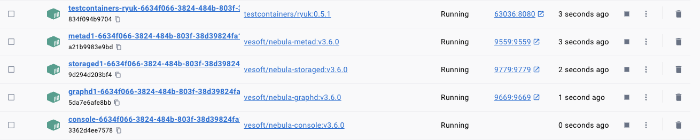

Testcontainers for NebulaGraph
---

![CI][Badge-CI] [![Nexus (Snapshots)][Badge-Snapshots]][Link-Snapshots] [![Sonatype Nexus (Releases)][Badge-Releases]][Link-Releases]

[Badge-CI]: https://github.com/nebula-contrib/testcontainers-nebula/actions/workflows/scala.yml/badge.svg
[Badge-Snapshots]: https://img.shields.io/nexus/s/io.github.jxnu-liguobin/testcontainers-nebula_3?server=https%3A%2F%2Foss.sonatype.org
[Link-Snapshots]: https://oss.sonatype.org/content/repositories/snapshots/io/github/jxnu-liguobin/testcontainers-nebula_3/

[Badge-Releases]: https://img.shields.io/nexus/r/io.github.jxnu-liguobin/testcontainers-nebula_3?server=https%3A%2F%2Foss.sonatype.org
[Link-Releases]: https://oss.sonatype.org/content/repositories/releases/io/github/jxnu-liguobin/testcontainers-nebula_3/

[Testcontainers](https://github.com/testcontainers/testcontainers-java)  is a Java library that supports JUnit tests, providing lightweight, throwaway instances of common databases, Selenium web browsers, or anything else that can run in a Docker container.

[NebulaGraph](https://github.com/vesoft-inc/nebula) is a popular open-source graph database that can handle large volumes of data with milliseconds of latency, scale up quickly, and have the ability to perform fast graph analytics. NebulaGraph has been widely used for social media, recommendation systems, knowledge graphs, security, capital flows, AI, etc.


## Introduction

Support Java 8+, Scala 3, Scala 2.13 and Scala 2.12

**sbt**:
```scala
"io.github.jxnu-liguobin" %% "testcontainers-nebula" % 'latest version'
```

**maven**:
```xml
<dependency>
    <groupId>io.github.jxnu-liguobin</groupId>
    <artifactId>testcontainers-nebula_2.13</artifactId>
    <version>'latest version'</version>
    <scope>test</scope>
</dependency>
```

**gradle**:
```groovy
testImplementation group: 'io.github.jxnu-liguobin', name: 'testcontainers-nebula_2.13', version: 'latest version'
```

## Usage Instructions

Java example: [SimpleNebulaCluster](./examples/src/main/java/testcontainers/containers/SimpleNebulaCluster.java)

ZIO example: [NebulaSpec](./zio/src/test/scala/testcontainers/containers/znebula/NebulaSpec.scala)

The zio module provides default configurations for better integration with zio-nebula, just adding dependency:
```scala
"io.github.jxnu-liguobin" %% "testcontainers-nebula-zio" % 'latest version'
// testcontainers-nebula-zio depends on zio-nebula dependency 
"io.github.jxnu-liguobin" %% "zio-nebula" % 'latest version'
```

Details:

1. `NebulaSimpleClusterContainer.scala` creates four container instances: graphd,metad,storaged,console.
2. `NebulaClusterContainer.scala` provides a generic definition, and any number of clusters can be created by implementing its abstraction methods, ports and volumes can be modified.

